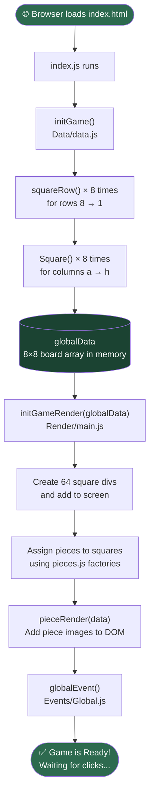
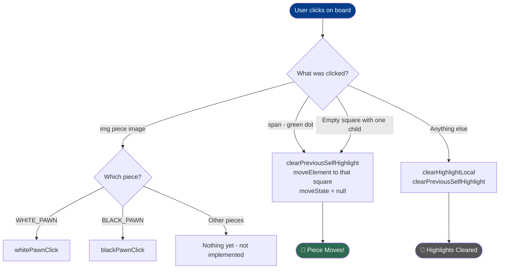
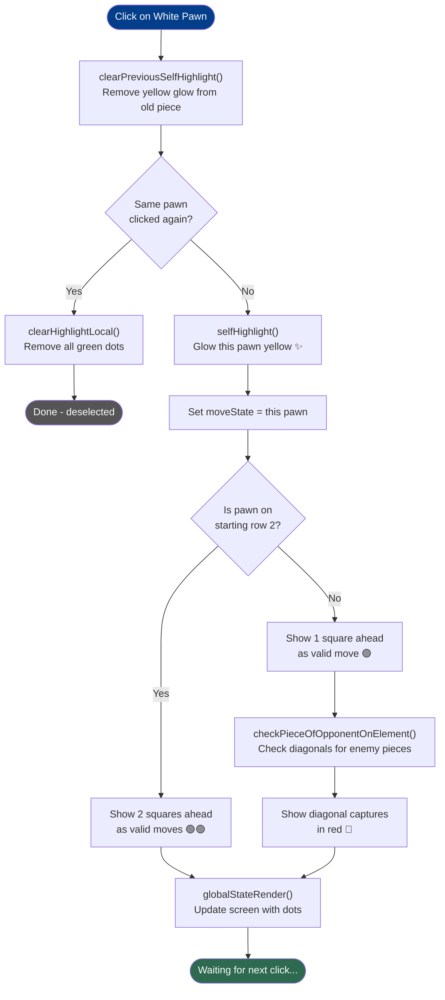
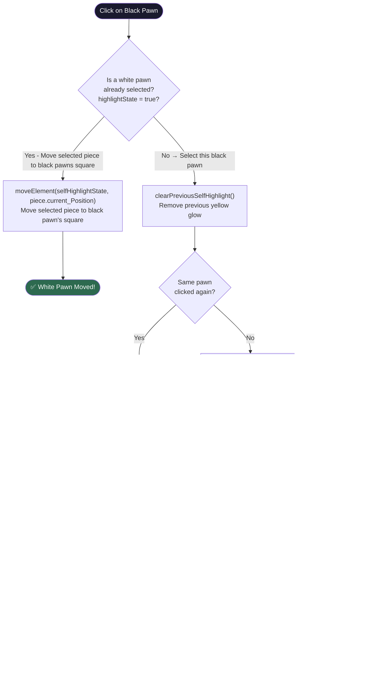
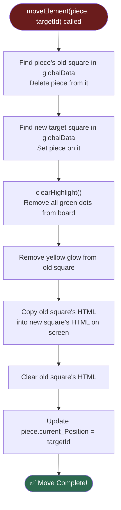
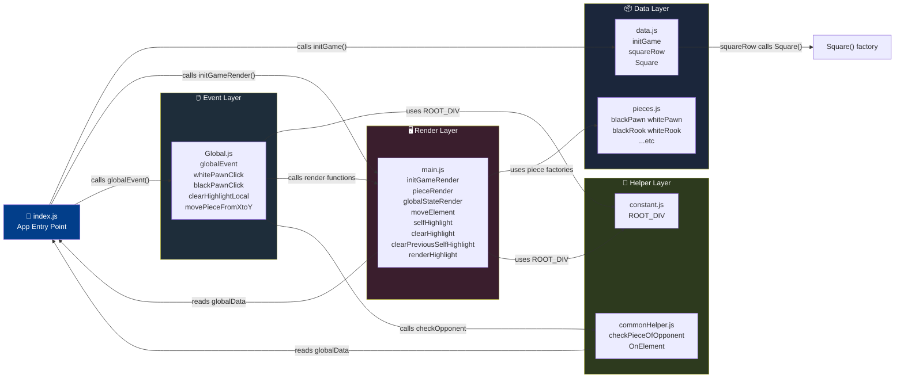

# ♟️ ChessCode — Visual Flowcharts

---

## 🟢 1. App Startup Flow

> What happens the moment you open the game.

---

## 🖱️ 2. Click Handler Flow

> What happens when you click anywhere on the board.

---

## ⬜ 3. White Pawn Click Flow

> What happens step by step when you click a white pawn.

---

## ⬛ 4. Black Pawn Click Flow

> What happens when you click a black pawn.

---

## 🏃 5. Piece Move Flow

> What happens when `moveElement()` is called.

---

## 🗺️ 6. Complete Big Picture

> All files and how they connect.

---

## 📋 Quick Summary Table

| Flow | Triggered By | Key Functions Called |
|------|-------------|---------------------|
| **App Start** | Browser loads page | `initGame` → `squareRow` → `Square` → `initGameRender` → `pieceRender` → `globalEvent` |
| **Click piece img** | User clicks pawn image | `whitePawnClick` or `blackPawnClick` |
| **Click green dot** | User clicks valid move square | `moveElement` → `clearHighlight` → `globalStateRender` |
| **White Pawn selected** | `whitePawnClick` runs | `clearPreviousSelfHighlight` → `selfHighlight` → `globalStateRender` |
| **Black Pawn selected** | `blackPawnClick` runs | Same as white OR `moveElement` if white was already selected |
| **Piece moves** | `moveElement` runs | `clearHighlight` → DOM swap → update `current_Position` |
