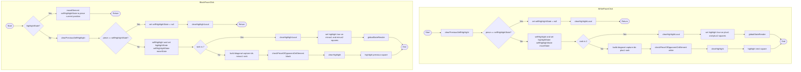

# Pawn Click Flowchart

```mermaid
flowchart TB
  subgraph WhitePawnClick
    W1([Start]) --> W2[clearPreviousSelfHighlight]
    W2 --> W3{piece == selfHighlightState?}
    W3 -- Yes --> W4[set selfHighlightState = null]
    W4 --> W5[clearHighlightLocal]
    W5 --> W6([Return])

    W3 -- No --> W7[selfHighlight and set highlightState selfHighlightState moveState]
    W7 --> W8{rank is 2}
    W8 -- Yes --> W9[clearHighlightLocal]
    W9 --> W10[set highlight true on plus1 and plus2 squares]
    W10 --> W11[globalStateRender]
    W11 --> W12([End])

    W8 -- No --> W13[build diagonal capture ids plus1 rank]
    W13 --> W14[checkPieceOfOpponentOnElement white]
    W14 --> W15[clearHighlight]
    W15 --> W16[highlight next square]
    W16 --> W12
  end

  subgraph BlackPawnClick
    B1([Start]) --> B2{highlightState?}
    B2 -- Yes --> B3[moveElement selfHighlightState to piece current position]
    B3 --> B4([Return])

    B2 -- No --> B5[clearPreviousSelfHighlight]
    B5 --> B6{piece == selfHighlightState?}
    B6 -- Yes --> B7[set selfHighlightState = null]
    B7 --> B8[clearHighlightLocal]
    B8 --> B9([Return])

    B6 -- No --> B10[selfHighlight and set highlightState selfHighlightState moveState]
    B10 --> B11{rank is 7}
    B11 -- Yes --> B12[clearHighlightLocal]
    B12 --> B13[set highlight true on minus1 and minus2 squares]
    B13 --> B14[globalStateRender]
    B14 --> B15([End])

    B11 -- No --> B16[build diagonal capture ids minus1 rank]
    B16 --> B17[checkPieceOfOpponentOnElement black]
    B17 --> B18[clearHighlight]
    B18 --> B19[highlight previous square]
    B19 --> B15
  end
```
