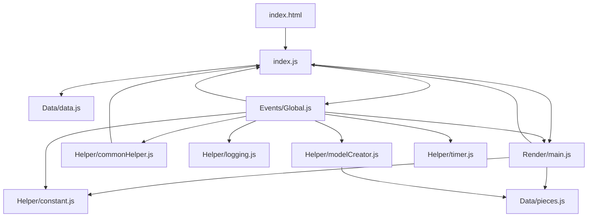
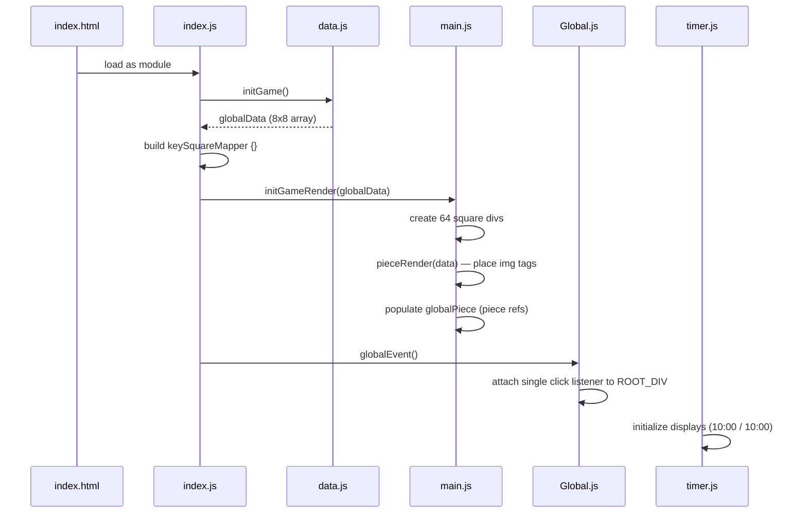
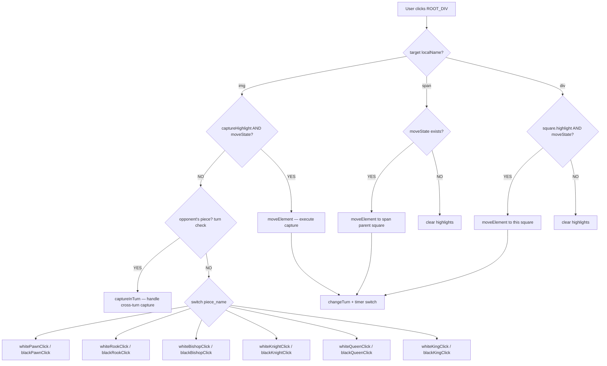
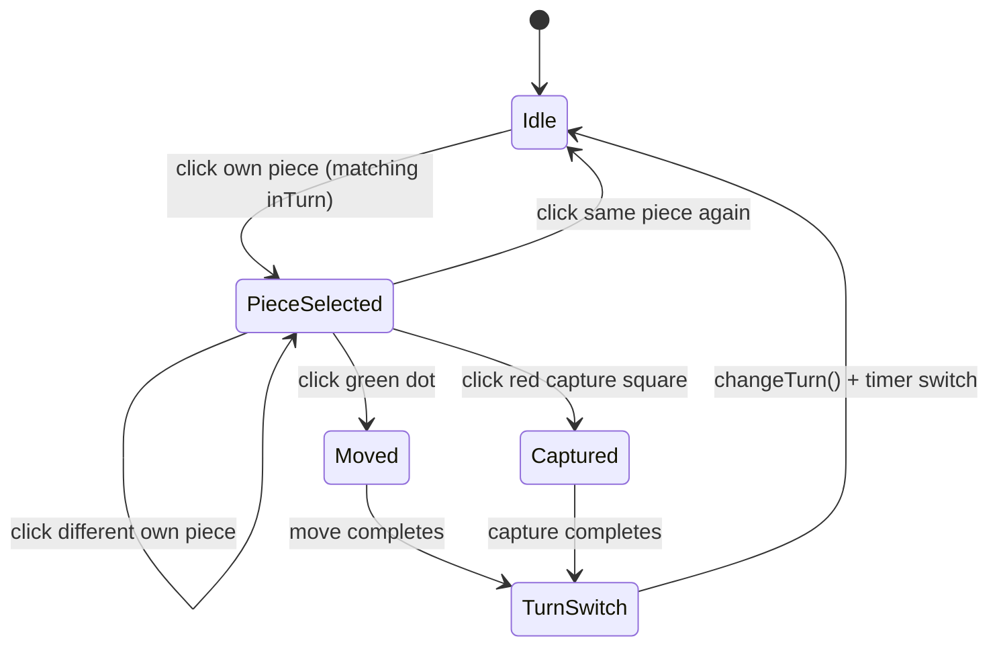

# 🏗️ ChessCode — System Architecture Design

**Project:** ChessCode  
**Stack:** Vanilla HTML + CSS + JavaScript (ES Modules)  
**Pattern:** MVC-style layered architecture, event delegation, centralized state  
**Last Updated:** July 4, 2026 — 08:40 PM IST

---

## 📐 Module Layer Map

```
┌──────────────────────────────────────────────────────┐
│                   Browser / DOM                      │
└───────────────────────┬──────────────────────────────┘
                        │  click events
                        ▼
┌──────────────────────────────────────────────────────┐
│              Events Layer  (Events/Global.js)        │
│  • globalEvent()   — single delegated click listener │
│  • 12 piece click handlers (turn-gated)              │
│  • changeTurn()    — toggle turn, update UI, timer   │
│  • moveElement()   — execute moves with logging      │
│  • checkForPawnPromotion() / callBackPawnPromotion()  │
│  • checkForCheck() — stub for check detection        │
│  • captureInTurn() — capture validation              │
└──────┬──────────────────────────────────────┬────────┘
       │ calls                                │ calls
       ▼                                      ▼
┌──────────────────┐                ┌──────────────────────┐
│   Helper Layer   │                │   Render Layer        │
│ commonHelper.js  │                │   Render/main.js      │
│ • checkPiece     │                │ • initGameRender()    │
│   OfOpponent     │                │ • pieceRender()       │
│ • checkSquare    │                │ • globalStateRender() │
│   CaptureId      │                │ • selfHighlight()     │
│ • giveXXX        │                │ • clearHighlight()    │
│   Ids()          │                │                       │
│ • giveXXX        │                └────────────┬─────────┘
│   CaptureIds()   │                             │
│                  │                             │
│ logging.js       │                             │
│ • logMoves()     │                             │
│                  │                             │
│ timer.js         │                             │
│ • ChessTimer     │                             │
│ • switchTurn()   │                             │
│                  │                             │
│ modelCreator.js  │                             │
│ • ModalCreater   │                             │
│ • pawnPromotion()│                             │
└──────┬───────────┘                             │
       │                                         │
       │ reads                                   │ reads/writes
       ▼                                         ▼
┌──────────────────────────────────────────────────────┐
│                   Data Layer                         │
│                                                      │
│  index.js — globalData (8×8 array) + keySquareMapper │
│            + globalPiece (named piece refs)           │
│  Data/data.js — Square(), squareRow(), initGame()    │
│  Data/pieces.js — 12 piece factory functions         │
│  Helper/constant.js — ROOT_DIV                       │
└──────────────────────────────────────────────────────┘
```

---

## 🔗 Import / Export Graph



---

## 🚀 Boot Sequence (Startup)



---

## 🖱️ Click Event Flow



---

## 🔄 State Machine (Game State Variables)



**Variables:**

| Variable | Type | Meaning |
|---|---|---|
| `highlightState` | `boolean` | `true` when a piece is selected and move dots are visible |
| `selfHighlightState` | `piece or null` | Piece object currently glowing yellow |
| `moveState` | `piece or null` | Piece ready to be moved on next valid click |
| `inTurn` | `string` | Current turn — `"white"` or `"black"` |
| `lastMoveFrom` | `string or null` | Square ID of last move origin (for `.lastMoveHighlight`) |
| `lastMoveTo` | `string or null` | Square ID of last move destination (for `.lastMoveHighlight`) |

---

## 📁 File Responsibility Summary

| File | Layer | Responsibility |
|---|---|---|
| `index.html` | Entry | Board layout with timer panel, turn indicator, move logger |
| `index.js` | Bootstrap | Runs 3-step init; exports `globalData`, `keySquareMapper`, `globalPiece` |
| `Data/data.js` | Data | `Square()`, `squareRow()`, `initGame()` — builds board array |
| `Data/pieces.js` | Data | 12 piece factory functions with `move` flag for castling-tracked pieces |
| `Helper/constant.js` | Shared | Exports `ROOT_DIV` |
| `Helper/commonHelper.js` | Logic | Move range calculators, capture detection, check-detection helpers |
| `Helper/logging.js` | UI | Move logger with Unicode chess symbols and chess notation |
| `Helper/timer.js` | Logic/UI | `ChessTimer` class — countdown, timeout, low-time warnings |
| `Helper/modelCreator.js` | UI | Pawn promotion modal with piece selection |
| `Render/main.js` | Render | All DOM operations: draw, highlight, move, clear |
| `Events/Global.js` | Events | All click handlers, turn management, move execution, timer integration |
| `style/style.css` | Style | Board, timers, logger, modals, last-move highlights, timeout overlay |
