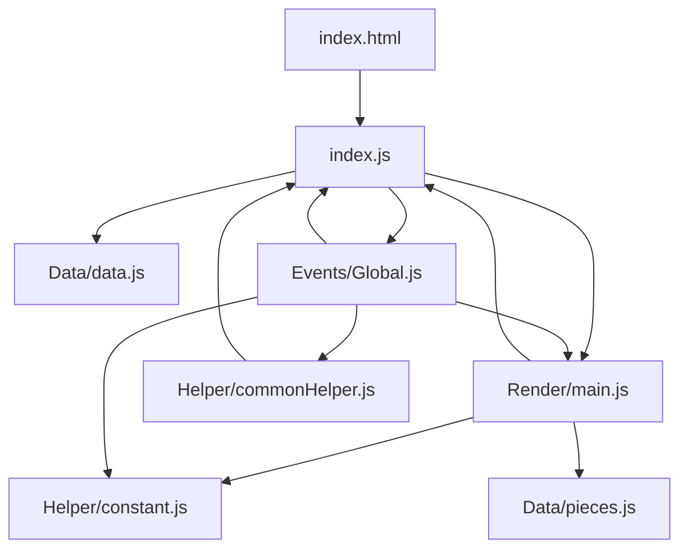
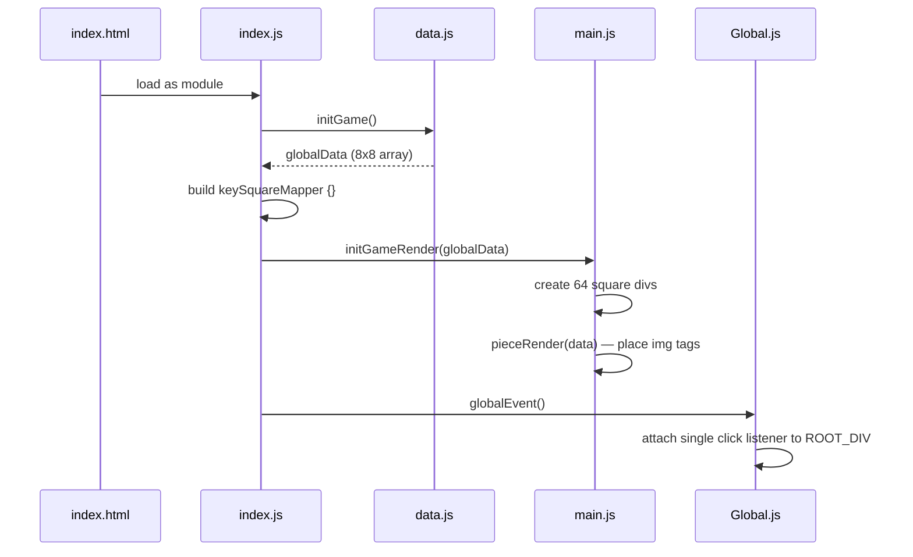
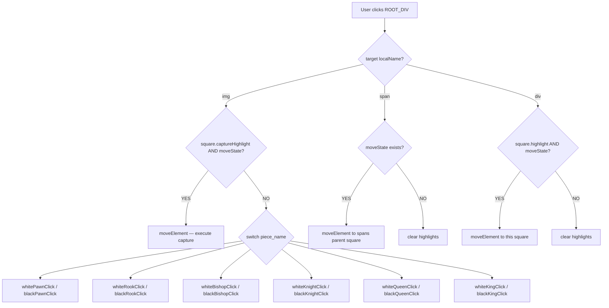
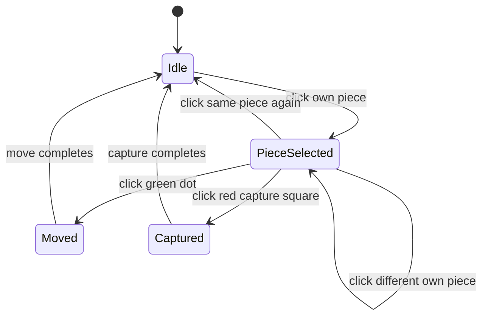

# 🏗️ ChessCode — System Architecture Design

**Project:** ChessCode  
**Stack:** Vanilla HTML + CSS + JavaScript (ES Modules)  
**Pattern:** MVC-style layered architecture, event delegation, centralized state  
**Last Updated:** June 30, 2026 — 08:25 PM IST

---

## 📐 Module Layer Map

```
┌──────────────────────────────────────────────────────┐
│                   Browser / DOM                      │
└───────────────────────┬──────────────────────────────┘
                        │  click events
                        ▼
┌──────────────────────────────────────────────────────┐
│              Events Layer  (Events/Global.js)        │
│  • globalEvent()   — single delegated click listener │
│  • 12 piece click handlers                           │
│  • clearPreviousSelfHighlight()                      │
│  • clearHighlightLocal()                             │
└──────┬──────────────────────────────────────┬────────┘
       │ calls                                │ calls
       ▼                                      ▼
┌──────────────┐                   ┌──────────────────────┐
│  Helper Layer│                   │   Render Layer        │
│ commonHelper │                   │   Render/main.js      │
│ • checkPiece │                   │ • initGameRender()    │
│   OfOpponent │                   │ • pieceRender()       │
│ • checkSquare│                   │ • globalStateRender() │
│   CaptureId  │                   │ • moveElement()       │
│ • giveXXX    │                   │ • selfHighlight()     │
│   Ids()      │                   │ • clearHighlight()    │
└──────┬───────┘                   └────────────┬─────────┘
       │                                        │
       │ reads                                  │ reads/writes
       ▼                                        ▼
┌──────────────────────────────────────────────────────┐
│                   Data Layer                         │
│                                                      │
│  index.js — globalData (8×8 array) + keySquareMapper │
│  Data/data.js — Square(), squareRow(), initGame()    │
│  Data/pieces.js — 12 piece factory functions         │
│  Helper/constant.js — ROOT_DIV                       │
└──────────────────────────────────────────────────────┘
```

---

## 🔗 Import / Export Graph



---

## 🚀 Boot Sequence (Startup)



---

## 🖱️ Click Event Flow



---

## 🔄 State Machine (3 State Variables)



**Variables:**

| Variable | Type | Meaning |
|---|---|---|
| `highlightState` | `boolean` | `true` when a piece is selected and move dots are visible |
| `selfHighlightState` | `piece or null` | Piece object currently glowing yellow |
| `moveState` | `piece or null` | Piece ready to be moved on next valid click |

---

## 📁 File Responsibility Summary

| File | Layer | Responsibility |
|---|---|---|
| `index.html` | Entry | Loads CSS and `index.js` as ES module |
| `index.js` | Bootstrap | Runs 3-step init; exports `globalData` + `keySquareMapper` |
| `Data/data.js` | Data | `Square()`, `squareRow()`, `initGame()` — builds board array |
| `Data/pieces.js` | Data | 12 piece factory functions returning `{ current_Position, img, piece_name }` |
| `Helper/constant.js` | Shared | Exports `ROOT_DIV` — used by both Render and Events layers |
| `Helper/commonHelper.js` | Logic | Move range calculators + capture detection utilities |
| `Render/main.js` | Render | All DOM operations: draw, highlight, move, clear |
| `Events/Global.js` | Events | All click handlers, game state variables, `globalEvent()` listener |
