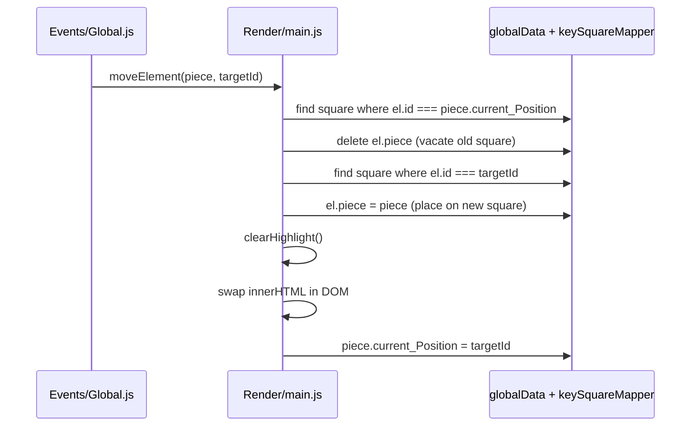

# 🗃️ ChessCode — Data Design

**Covers:** All data structures, object schemas, and lookup systems used in ChessCode.  
**Last Updated:** June 30, 2026 — 08:25 PM IST

---

## 🗺️ Big Picture: Two Data Stores

```
globalData          →  source of truth for board state
keySquareMapper     →  O(1) lookup dictionary (id → square)
```

Both are created in `index.js` and exported to every module that needs them.

---

## 📦 `globalData` — The Board Array

### Shape
An **8×8 nested array** where each row is an array of 8 Square objects.

```js
globalData[rowIndex][colIndex] = Square

globalData[0]    // Row 8 — Black pieces start here
globalData[7]    // Row 1 — White pieces start here
globalData[0][0] // Square a8
globalData[7][4] // Square e1 (white king)
```

### Row Mapping

| `globalData[i]` | Chess Row | Contents |
|---|---|---|
| `[0]` | Row 8 | Black rook, knight, bishop, queen, king, bishop, knight, rook |
| `[1]` | Row 7 | Black pawns |
| `[2]` | Row 6 | Empty |
| `[3]` | Row 5 | Empty |
| `[4]` | Row 4 | Empty |
| `[5]` | Row 3 | Empty |
| `[6]` | Row 2 | White pawns |
| `[7]` | Row 1 | White rook, knight, bishop, queen, king, bishop, knight, rook |

---

## 🔲 Square Object Schema

Created by `Square(color, piece, id)` in `Data/data.js`.

```js
{
  id:               "e2",        // String — chess coordinate (column a–h + row 1–8)
  color:            "white",     // String — "white" or "black" (square tile color)
  piece:            null,        // Piece object or null (no piece on this square)

  // Runtime state — added dynamically during gameplay
  highlight:        true,        // Boolean/null — true = show green move dot
  captureHighlight: true,        // Boolean — true = square is a capture target (red)
}
```

### ID Format

```
id = column + row
   = [a–h]  + [1–8]

Examples:
  "a1" → bottom-left (white queen-side rook)
  "h8" → top-right   (black king-side rook)
  "e4" → center square (e file, row 4)
```

---

## ♟️ Piece Object Schema

Created by factory functions in `Data/pieces.js`.

```js
{
  current_Position: "e2",            // String — current square ID (updated on move)
  img:              "./Assets/Pieces/white/pawn.png",  // Asset path
  piece_name:       "WHITE_PAWN",    // Identifier — format: COLOR_TYPE
}
```

### `piece_name` Values

| piece_name | Color | Type |
|---|---|---|
| `WHITE_PAWN` | White | Pawn |
| `WHITE_ROOK` | White | Rook |
| `WHITE_KNIGHT` | White | Knight |
| `WHITE_BISHOP` | White | Bishop |
| `WHITE_QUEEN` | White | Queen |
| `WHITE_KING` | White | King |
| `BLACK_PAWN` | Black | Pawn |
| `BLACK_ROOK` | Black | Rook |
| `BLACK_KNIGHT` | Black | Knight |
| `BLACK_BISHOP` | Black | Bishop |
| `BLACK_QUEEN` | Black | Queen |
| `BLACK_KING` | Black | King |

### Color Detection Pattern

```js
// Check if piece is white
piece.piece_name.startsWith("WHITE_")

// Check if piece is black
piece.piece_name.startsWith("BLACK_")

// Check if piece contains opponent color
piece.piece_name.includes("BLACK") // used by checkPieceOfOpponentOnElement("white")
```

---

## ⚡ `keySquareMapper` — O(1) Square Lookup

### Purpose
A flat dictionary built from `globalData` that maps every square ID directly to its Square object. Avoids slow O(64) `Array.flat().forEach()` scans on every click.

### Shape
```js
keySquareMapper = {
  "a1": { id: "a1", color: "black", piece: {...} },
  "a2": { id: "a2", color: "white", piece: {...} },
  // ... all 64 squares
  "h8": { id: "h8", color: "black", piece: {...} },
}
```

### How It's Built
```js
// In index.js — O(N) one-time setup
let keySquareMapper = {};
globalData.flat().forEach((square) => {
  keySquareMapper[square.id] = square;
});
```

### Usage Pattern
```js
// Anywhere in the codebase — O(1) lookup
const square = keySquareMapper["e4"];
square.highlight = true;
```

---

## 🔁 Data Flow on Piece Move



---

## 🗂️ Asset Path Convention

```
Assets/
  Pieces/
    white/
      pawn.png
      rook.png
      knight.png
      bishop.png
      queen.png
      king.png
    black/
      pawn.png
      rook.png
      knight.png
      bishop.png
      queen.png
      king.png
```

Path format in piece objects: `"./Assets/Pieces/{color}/{type}.png"`
