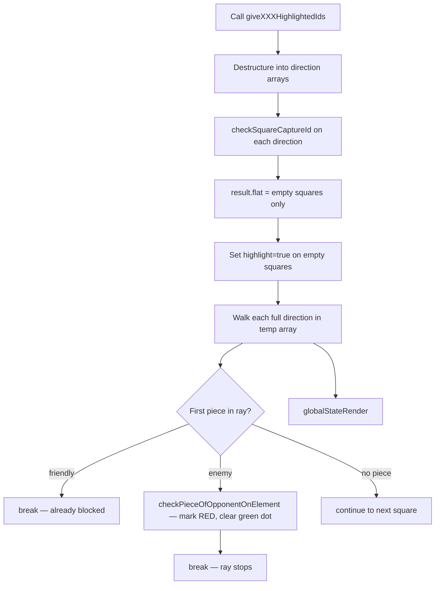

# ♟️ ChessCode — Piece Movement Design

**Covers:** Movement rules, highlight calculation, capture detection, and ray-blocking logic for all 6 piece types.  
**Last Updated:** June 30, 2026 — 08:25 PM IST

---

## 🔧 Core Utilities

All movement logic relies on three functions in `Helper/commonHelper.js`:

| Function | Purpose |
|---|---|
| `checkSquareCaptureId(array)` | Walks a ray array, stops before any occupied square — returns only empty squares |
| `checkWhetherPieceExistOrNot(id)` | Returns the square if it has a piece, `false` otherwise |
| `checkPieceOfOpponentOnElement(id, color)` | If the square has an enemy piece, marks it red (`captureHighlight`) and clears its green dot |

### Ray Blocking Pattern (for sliding pieces)

```
Ray:  [a3, a4, a5, a6, a7, a8]  ← generated by helper
            ↑
       a4 has a piece

checkSquareCaptureId → [a3]       ← green dots up to blocker
temp loop             → checks a4 → if enemy: mark RED
                                    if friendly: skip (already blocked)
```

---

## ♙ Pawn

### White Pawn

**Direction:** Upward (row + 1)  
**First move:** 2 squares if still on row 2  
**Captures:** Diagonals only (±1 column, +1 row)

```
Starting (row 2):          Not starting:
  🟢 🔴 🔴                  🔴 🔴
  🟢                           🟢
  ♙                            ♙
```

**Move squares:**
```js
// From e2
["e3", "e4"]   // row 2 → 2 forward squares

// From e4
["e5"]         // other rows → 1 forward square
```

**Capture squares:**
```js
col1 = charCode(col - 1) + (row + 1)  // left diagonal
col2 = charCode(col + 1) + (row + 1)  // right diagonal
// Example from e4: ["d5", "f5"]
```

> **Rule:** `checkSquareCaptureId` is used for forward moves (stops if blocked). Captures use `checkPieceOfOpponentOnElement` directly — diagonal squares are independent.

---

### Black Pawn

**Direction:** Downward (row - 1)  
**First move:** 2 squares if still on row 7  
**Captures:** Diagonals (±1 column, -1 row)

```
  ♟
  🟢
🔴 🔴
```

**Move squares:**
```js
// From e7
["e6", "e5"]   // row 7 → 2 forward squares (downward)

// From e5
["e4"]         // other rows → 1 forward square
```

---

## ♜ Rook

**Directions:** 4 straight rays (top, bottom, left, right)  
**Range:** Unlimited until blocked  
**Captures:** First enemy piece on each ray

```
     🟢
     🟢
🟢🟢 ♜ 🟢🔴
     🟢
```

**Helper:** `giveRookHighlightedIds(pos)` → `{ top, bottom, left, right }`

**Algorithm:**
```
For each direction:
  1. Generate full ray array
  2. checkSquareCaptureId → empty squares get green dots
  3. Walk temp array: first piece on ray →
       friendly → stop (already blocked by step 2)
       enemy    → mark RED (captureHighlight)
```

---

## ♝ Bishop

**Directions:** 4 diagonal rays (topLeft, topRight, bottomLeft, bottomRight)  
**Range:** Unlimited until blocked  
**Captures:** First enemy piece on each diagonal

```
🔴     🟢
  ♝
🟢     🔴
```

**Helper:** `giveBishopHighlightedIds(pos)` → `{ topLeft, topRight, bottomLeft, bottomRight }`

**Same algorithm as Rook** — 4 rays, `checkSquareCaptureId` + `temp` loop.

---

## ♞ Knight

**Pattern:** L-shape — 2 squares in one direction, 1 perpendicular  
**Range:** Fixed (jumps, not rays — cannot be blocked)  
**Captures:** Any enemy piece on a valid landing square

```
🟢 . 🟢
. ♞ .
🟢 . 🟢
(simplified — actual L-shape)
```

**Helper:** `giveKnightHighlightedIds(pos)` → flat array of all valid landing square IDs

**Algorithm (unique — no ray blocking):**
```js
highlightedSquareIds.forEach((id) => {
  const square = keySquareMapper[id];
  if (!square) return;

  if (square.piece === null || square.piece === undefined) {
    square.highlight = true;           // empty → green dot
  } else {
    checkPieceOfOpponentOnElement(id, color);  // occupied → check for capture
  }
});
```

> Knights skip over pieces — no `checkSquareCaptureId` needed.

---

## ♛ Queen

**Directions:** All 8 — combines Rook + Bishop  
**Range:** Unlimited until blocked  
**Captures:** First enemy piece on each ray

```
🔴 🟢 🔴
🟢 ♛ 🟢
🔴 🟢 🔴
```

**Helper:** `giveQueenHighlightedIds(pos)` → `{ top, bottom, left, right, topLeft, topRight, bottomLeft, bottomRight }`

```js
// Internally:
function giveQueenHighlightedIds(id) {
  return {
    ...giveRookHighlightedIds(id),
    ...giveBishopHighlightedIds(id),
  };
}
```

**Same algorithm as Rook/Bishop** — 8 rays total.

---

## ♚ King

**Directions:** All 8  
**Range:** 1 square per direction only  
**Captures:** Any enemy piece 1 square away

```
🔴 🟢 🔴
🟢 ♚ 🟢
🔴 🟢 🔴
```

**Helper:** `giveKingHighlightedIds(pos)` — reuses Rook + Bishop helpers but slices each ray to `[0]` (first square only):

```js
for (const key in returnResult) {
  if (element.length !== 0) {
    returnResult[key] = [element[0]];  // ← only 1 square per direction
  }
}
```

**Same algorithm as Rook/Bishop** — but rays have max 1 element.

---

## 🔄 Shared Sliding-Piece Algorithm

All pieces except Knight follow this pattern:



---

## 📏 Move Range Summary Table

| Piece | Max Range | Directions | Can Jump? | Captures |
|---|---|---|---|---|
| Pawn | 1 (2 from start) | Forward only | No | Diagonal only |
| Rook | 7 | Straight (4) | No | First enemy on ray |
| Bishop | 7 | Diagonal (4) | No | First enemy on ray |
| Knight | Fixed L-shape | 8 possible landing squares | **Yes** | Any enemy on landing |
| Queen | 7 | All 8 directions | No | First enemy on ray |
| King | 1 | All 8 directions | No | Any adjacent enemy |
