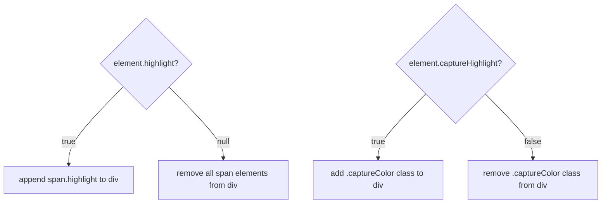

# 🎨 ChessCode — UI/UX Design

**Covers:** Visual design system, color palette, CSS class system, board layout, and the highlighting state model.  
**Last Updated:** June 30, 2026 — 08:25 PM IST

---

## 🎨 Color Palette

| Token | Hex | Usage |
|---|---|---|
| Page background | `#302E2B` | Dark charcoal — mimics chess.com dark theme |
| Light square | `#ebecd0` | Cream — classic light tile |
| Dark square | `#779556` | Olive green — classic dark tile |
| Selected piece | `#f7f769` | Bright yellow — self-highlight glow |
| Capture target | `#EE4b2b` | Vivid red-orange — enemy capture square |
| Move dot fill | `rgba(0,0,0,0.2)` | Translucent black — valid move indicator |
| Global text | `white` | Applied via `* { color: white }` |

---

## 📐 Board Layout

### Dimensions

```
Board total:  560px × 560px
Square size:   70px ×  70px  (8 × 70 = 560)
Piece image:   70px ×  70px  (fills square completely)
Move dot:      20px ×  20px  (centered via absolute position)
```

### Structure

```html
<div id="root">          ← flex column, centered on page, width: max-content
  <div class="squareRow">   ← flex row, 560px wide, 70px tall
    <div id="a8" class="black square"> ... </div>
    <div id="b8" class="white square"> ... </div>
    ...8 squares...
  </div>
  ...8 rows...
</div>
```

### Color Assignment

Squares alternate based on row parity:

```
Even rows (2, 4, 6, 8):  a=white, b=black, c=white, d=black ...
Odd  rows (1, 3, 5, 7):  a=black, b=white, c=black, d=white ...
```

---

## 🏷️ CSS Class System

### Base Classes

| Class | Applied To | Effect |
|---|---|---|
| `.square` | Every `div` square | `70×70px`, `position: relative` |
| `.white` | Light tile squares | `background: #ebecd0` |
| `.black` | Dark tile squares | `background: #779556` |
| `.squareRow` | Each row wrapper | `flex, 560×70px` |
| `.piece` | Piece `` tags | `70×70px`, `cursor: pointer` |

### State Classes (added/removed at runtime)

| Class | Applied To | Trigger | Effect |
|---|---|---|---|
| `.highlightYellow` | Square `div` | Piece selected | Yellow background `#f7f769` |
| `.captureColor` | Square `div` | Enemy piece in range | Red-orange background `#EE4b2b` |

### DOM Children (highlight dot)

| Element | Class | Trigger | Effect |
|---|---|---|---|
| `<span>` | `.highlight` | `element.highlight = true` | 20px dark circle centered in square |

---

## 🔦 Highlight State Model

Each square in `globalData` has two flags that drive visual feedback:

```
square.highlight        → null / true
square.captureHighlight → false / true
```

### Rendering Rules



### Priority Rule

> **Capture beats move-dot:** When a square is marked as a capture target (`captureHighlight = true`), its `highlight` flag is immediately cleared to `null`. This prevents the green dot from rendering underneath the red background.

```js
// In checkPieceOfOpponentOnElement():
element.captureHighlight = true;
element.highlight = null;  // ← priority rule enforced here
```

---

## 📊 Visual State Table

| Square State | `.highlightYellow` | `.captureColor` | `span.highlight` | Appearance |
|---|---|---|---|---|
| Default (empty) | ❌ | ❌ | ❌ | Normal tile color |
| Selected piece | ✅ | ❌ | ❌ | Yellow glow |
| Valid move dot | ❌ | ❌ | ✅ | Dark circle in center |
| Capture target | ❌ | ✅ | ❌ | Red-orange tile |

---

## 🖼️ Piece Image Layout

```
Piece  sits inside square <div>
  ↳ width: 70px, height: 70px
  ↳ display: block, margin: auto
  ↳ cursor: pointer (triggers click events)

Highlight <span> is absolutely positioned inside square <div>
  ↳ position: absolute
  ↳ top: 50%, left: 50%
  ↳ transform: translate(-50%, -50%)
  ↳ width: 20px, height: 20px, border-radius: 50%
```

---

## 📱 Responsive Considerations

> ⚠️ The board is currently **fixed at 560×560px** and does not scale for mobile or small screens. Future improvements:
> - Replace `px` sizes with `clamp()` or `vmin` units
> - Add `max-width: 100%` on `#root`
> - Make piece images `width: 100%` relative to square

---

## 🔮 Design Tokens Cheatsheet

```css
/* Colors */
--bg-page:       #302E2B;
--sq-light:      #ebecd0;
--sq-dark:       #779556;
--hl-selected:   #f7f769;
--hl-capture:    #EE4b2b;
--hl-dot:        rgba(0, 0, 0, 0.2);

/* Sizes */
--board-size:    560px;
--square-size:   70px;
--dot-size:      20px;
```
