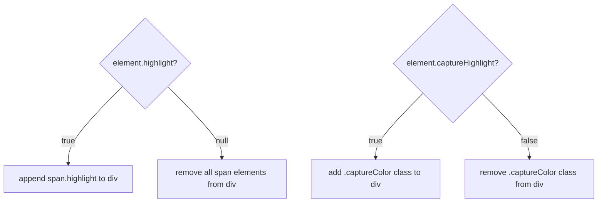

# 🎨 ChessCode — UI/UX Design

**Covers:** Visual design system, color palette, CSS class system, board layout, timer/logger UI, and the highlighting state model.  
**Last Updated:** July 4, 2026 — 08:40 PM IST

---

## 🎨 Color Palette

| Token | Hex | Usage |
|---|---|---|
| Page background | `#302E2B` | Dark charcoal — mimics chess.com dark theme |
| Light square | `#ebecd0` | Cream — classic light tile |
| Dark square | `#779556` | Olive green — classic dark tile |
| Selected piece | `#f7f769` | Bright yellow — self-highlight glow |
| Capture target | `#EE4b2b` | Vivid red-orange — enemy capture square |
| Move dot fill | `rgba(0,0,0,0.2)` | Translucent black — valid move indicator |
| Last move highlight | `rgba(255,255,50,0.38)` | Translucent yellow — source/destination of last move |
| Timer active glow | `rgba(100,255,170,0.3)` | Green glow — active player's timer |
| Timer low-time | `#ff4444` | Red — below 30 seconds warning |
| Global text | `white` | Applied via `* { color: white }` |
| Side panel background | `#262522` | Dark panels — logger, turn indicator |
| Side panel border | `#3d3b37` | Subtle border — separates panels |

---

## 📐 Board Layout

### Dimensions

```
Board total:  600px × 600px
Square size:   75px ×  75px  (8 × 75 = 600)
Piece image:   75px ×  75px  (fills square completely)
Move dot:      25px ×  25px  (centered via absolute position)
```

### Page Layout (Flexbox)

```
┌─────────────────────────────────────────────────────────┐
│  body#flex (display: flex, gap: 24px)                   │
│                                                          │
│  ┌────────────────────┐  ┌────────────────────────────┐ │
│  │  .board-container  │  │  .side-panel               │ │
│  │                    │  │                            │ │
│  │  ┌──────────────┐  │  │  ┌──────────────────────┐ │ │
│  │  │ #black-timer │  │  │  │ #turn-indicator      │ │ │
│  │  └──────────────┘  │  │  │  ⚪ White's Turn     │ │ │
│  │  ┌──────────────┐  │  │  └──────────────────────┘ │ │
│  │  │    #root     │  │  │  ┌──────────────────────┐ │ │
│  │  │  (8×8 board) │  │  │  │ #chessboardmovelogger│ │ │
│  │  │              │  │  │  │  ┌─ Moves ────────┐  │ │ │
│  │  └──────────────┘  │  │  │  │ 1. e2→e4  e7→e5│  │ │ │
│  │  ┌──────────────┐  │  │  │  │ 2. ...         │  │ │ │
│  │  │ #white-timer │  │  │  │  └────────────────┘  │ │ │
│  │  └──────────────┘  │  │  └──────────────────────┘ │ │
│  └────────────────────┘  └────────────────────────────┘ │
└─────────────────────────────────────────────────────────┘
```

---

## 🏷️ CSS Class System

### Base Classes

| Class | Applied To | Effect |
|---|---|---|
| `.square` | Every `div` square | `75×75px`, `position: relative` |
| `.white` | Light tile squares | `background: #ebecd0` |
| `.black` | Dark tile squares | `background: #779556` |
| `.squareRow` | Each row wrapper | `flex, 600×75px` |
| `.piece` | Piece `` tags | `75×75px`, `cursor: pointer` |

### State Classes (added/removed at runtime)

| Class | Applied To | Trigger | Effect |
|---|---|---|---|
| `.highlightYellow` | Square `div` | Piece selected | Yellow background `#f7f769` |
| `.captureColor` | Square `div` | Enemy piece in range | Red-orange background `#EE4b2b` |
| `.lastMoveHighlight` | Square `div` | After move completes | Translucent yellow on source + destination |

### Timer Classes

| Class | Applied To | Trigger | Effect |
|---|---|---|---|
| `.timer` | Timer `div` | Always | Base timer styling |
| `.active-timer` | Timer `div` | Current player's turn | Green border, bright text, glow |
| `.low-time` | Timer `div` | < 30 seconds remaining | Red background, pulsing text |

### Turn Indicator Classes

| Class | Applied To | Trigger | Effect |
|---|---|---|---|
| `.turn-dot-white` | `#turn-dot` | White's turn | White dot with glow |
| `.turn-dot-black` | `#turn-dot` | Black's turn | Dark dot with border |

### DOM Children (highlight dot)

| Element | Class | Trigger | Effect |
|---|---|---|---|
| `<span>` | `.highlight` | `element.highlight = true` | 25px dark circle centered in square |

---

## 🔦 Highlight State Model

Each square in `globalData` has two flags that drive visual feedback:

```
square.highlight        → null / true
square.captureHighlight → false / true
```

### Rendering Rules



### Priority Rule

> **Capture beats move-dot:** When a square is marked as a capture target (`captureHighlight = true`), its `highlight` flag is immediately cleared to `null`. This prevents the green dot from rendering underneath the red background.

---

## 📊 Visual State Table

| Square State | `.highlightYellow` | `.captureColor` | `.lastMoveHighlight` | `span.highlight` | Appearance |
|---|---|---|---|---|---|
| Default (empty) | ❌ | ❌ | ❌ | ❌ | Normal tile color |
| Selected piece | ✅ | ❌ | ❌ | ❌ | Yellow glow |
| Valid move dot | ❌ | ❌ | ❌ | ✅ | Dark circle in center |
| Capture target | ❌ | ✅ | ❌ | ❌ | Red-orange tile |
| Last move square | ❌ | ❌ | ✅ | ❌ | Translucent yellow overlay |

---

## ⏱️ Timer UI

```
┌─────────────────────────────────┐
│  Black         10:00            │  ← #black-timer (top of board)
├─────────────────────────────────┤
│                                 │
│          8×8 Board              │
│                                 │
├─────────────────────────────────┤
│  White         09:42            │  ← #white-timer (bottom, .active-timer)
└─────────────────────────────────┘
```

- **Active timer** has green accent, bright white text with subtle glow
- **Low-time** (< 30s) pulses red with `animation: pulse-time 1s infinite`
- **Timeout** shows full-screen overlay with winner announced

---

## 🔮 Design Tokens Cheatsheet

```css
/* Fonts */
--font-ui:       "Inter", sans-serif;
--font-mono:     "JetBrains Mono", monospace;

/* Colors */
--bg-page:       #302E2B;
--sq-light:      #ebecd0;
--sq-dark:       #779556;
--hl-selected:   #f7f769;
--hl-capture:    #EE4b2b;
--hl-dot:        rgba(0, 0, 0, 0.2);
--hl-lastmove:   rgba(255, 255, 50, 0.38);
--panel-bg:      #262522;
--panel-border:  #3d3b37;
--timer-active:  rgba(100, 255, 170, 0.3);
--timer-low:     #ff4444;

/* Sizes */
--board-size:    600px;
--square-size:   75px;
--dot-size:      25px;
```
