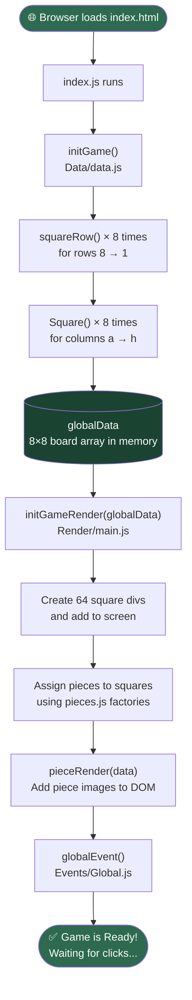
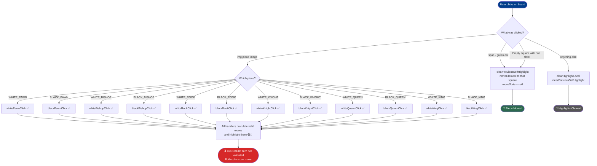
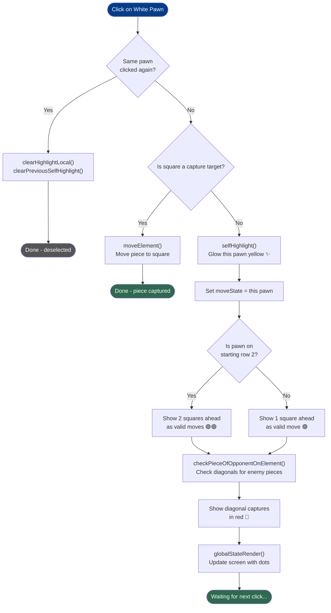
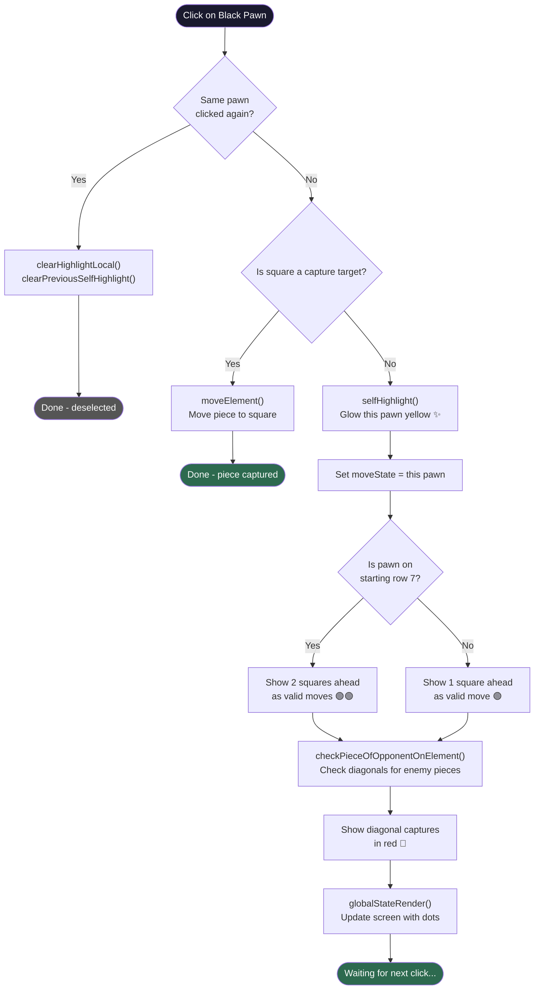
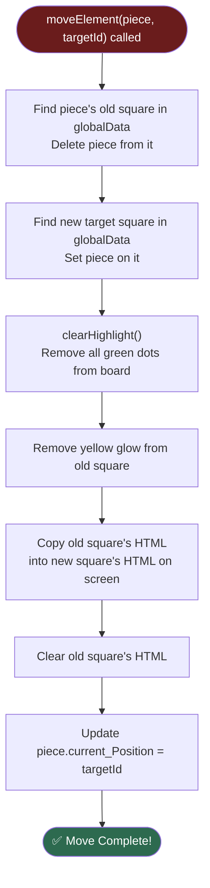
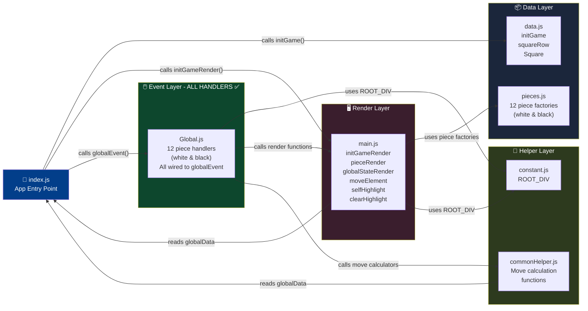
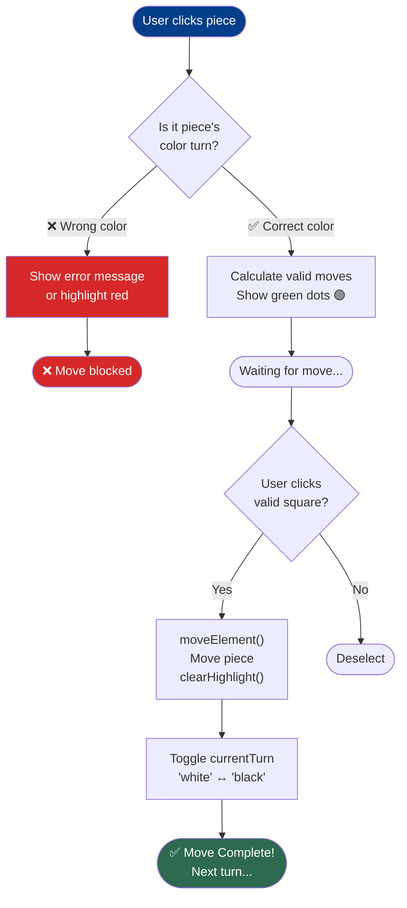

# ♟️ ChessCode — Visual Flowcharts

**Last Updated:** June 30, 2026 — 08:25 PM IST (All piece handlers are now implemented! See updated Click Handler Flow below.)

⏳ **Current Status:** Handlers exist for all pieces but turn validation blocks full gameplay.

---

## 🟢 1. App Startup Flow

> What happens the moment you open the game.

---

## 🖱️ 2. Click Handler Flow

> What happens when you click anywhere on the board.

**June 22 Update:** All piece handlers now exist and are wired into the switch statement. The blocker is turn validation—without it, both white and black can move any piece.

---

## ⬜ 3. White Pawn Click Flow

> What happens step by step when you click a white pawn.

---

## ⬛ 4. Black Pawn Click Flow

> What happens when you click a black pawn.

---

## 🏃 5. Piece Move Flow

> What happens when `moveElement()` is called.

---

## 🗺️ 6. Complete Big Picture

> All files and how they connect. Updated June 22, 2026 to show all piece handlers.

**June 22 Update:** Event Layer now shows all piece handlers are implemented! ⏳ Blocker: Turn validation needed.

---

## ⏳ 7. Turn Management Flow (To Be Implemented)

> What SHOULD happen when turn validation is implemented.

**What needs to happen:**
1. Add `let currentTurn = "white"` state in Global.js
2. In each piece handler: check if `piece.piece_name` color matches `currentTurn`
3. In `moveElement()`: toggle `currentTurn` after successful move

**Timeline:** ~30 minutes to implement

---

| Flow | Triggered By | Key Functions Called |
|------|-------------|---------------------|
| **App Start** | Browser loads page | `initGame` → `initGameRender` → `globalEvent` |
| **Click ANY piece img** | User clicks pawn, rook, bishop, knight, queen, or king | Dispatches to appropriate handler (whitePawnClick, whiteRookClick, etc.) |
| **Click green dot** | User clicks valid move square | `moveElement` → `clearHighlight` → `globalStateRender` |
| **Any piece selected** | Any click handler runs | `clearPreviousSelfHighlight` → `selfHighlight` → `globalStateRender` |
| **Piece moves** | `moveElement` runs | `clearHighlight` → DOM swap → update `current_Position` |

**June 22 Update:** All 12 piece handlers now have click handlers in the system. ⏳ **Blocker:** No turn validation — both colors can move any piece.
