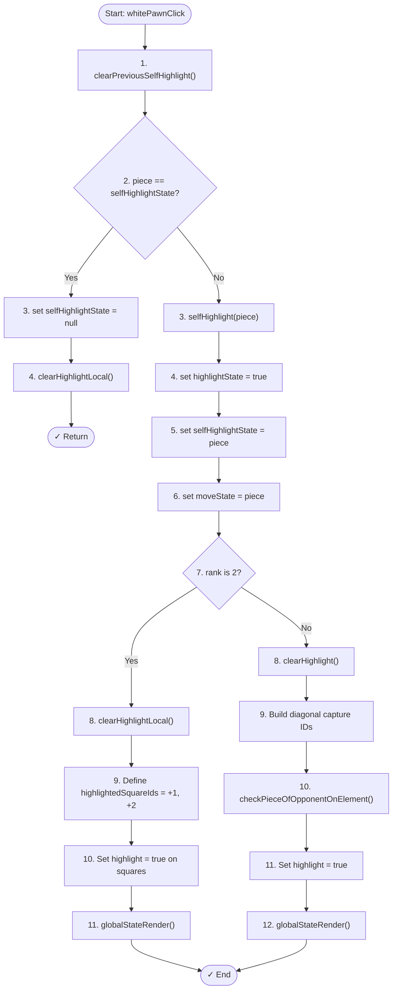
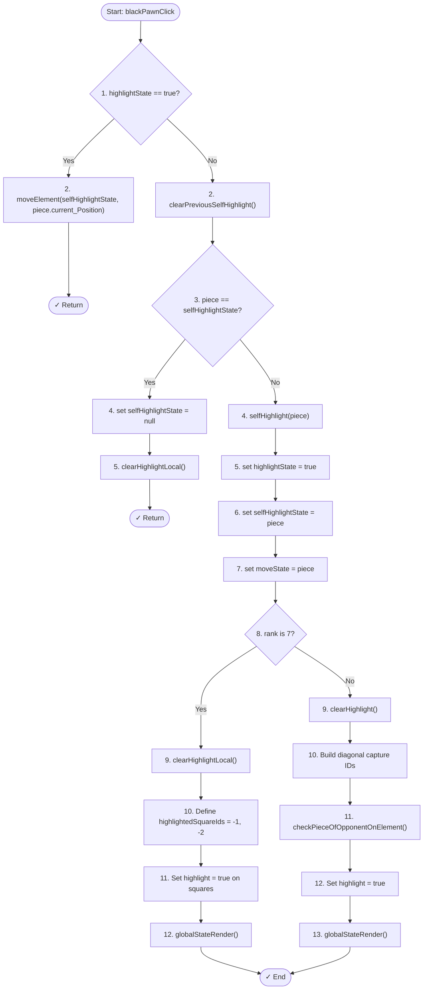

# Pawn Click Flowchart - Line by Line Sequential Flow

## White Pawn Click - Top to Bottom Flow

## Black Pawn Click - Top to Bottom Flow

---

## Summary Table

| Step | White Pawn | Black Pawn |
|------|-----------|-----------|
| 1 | Clear previous highlight | Check if any piece selected |
| 2 | Check if same pawn clicked | Clear previous highlight |
| 3a | Deselect (if same) | Check if same pawn clicked |
| 3b | Select & show moves (if different) | Deselect (if same) |
| 4b-7b | Highlight based on rank | Select & show moves (if different) |
| 8+ | Render to screen | Highlight based on rank |
