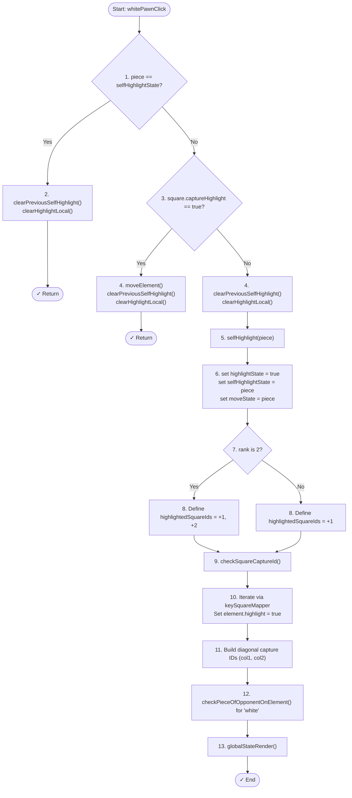

# Pawn Click Flowchart - Line by Line Sequential Flow

**Updated June 22, 2026:** All piece handlers implemented. These flowcharts show the pawn logic pattern that all other pieces follow (rooks, bishops, knights, queens, kings). 

⏳ **Blocker:** Turn validation not implemented — both colors can move any piece.

---

## Black Pawn Click - Top to Bottom Flow

---

## Summary Table

| Step | White Pawn | Black Pawn |
|------|-----------|-----------|
| 1 | Check if same pawn clicked | Check if same pawn clicked |
| 2 | Check if square is capture target | Check if square is capture target |
| 3 | Deselect (if same) or Move (if capture) | Deselect (if same) or Move (if capture) |
| 4 | Select pawn & set states | Select pawn & set states |
| 5 | Determine moves (+1/+2) | Determine moves (-1/-2) |
| 6 | Check diagonals for captures | Check diagonals for captures |
| 7 | Render to screen | Render to screen |
