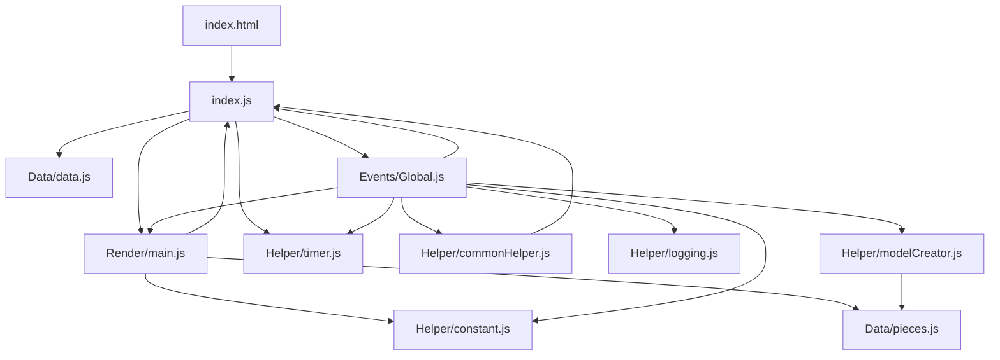
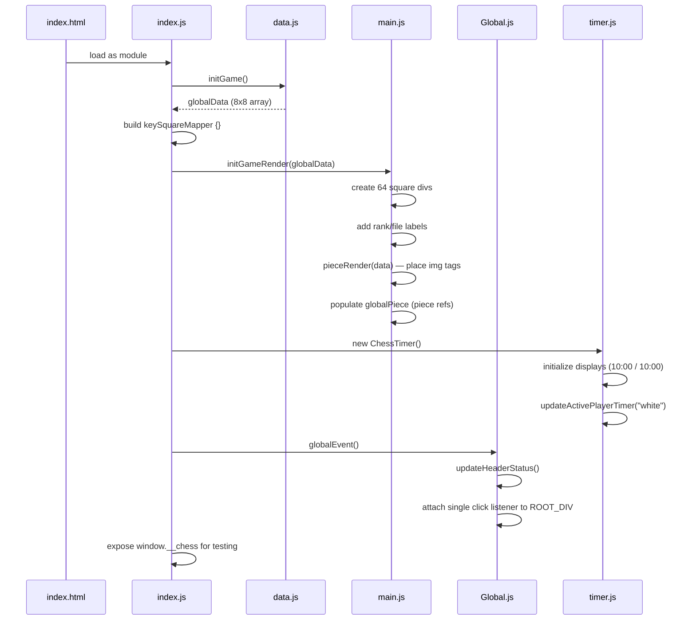
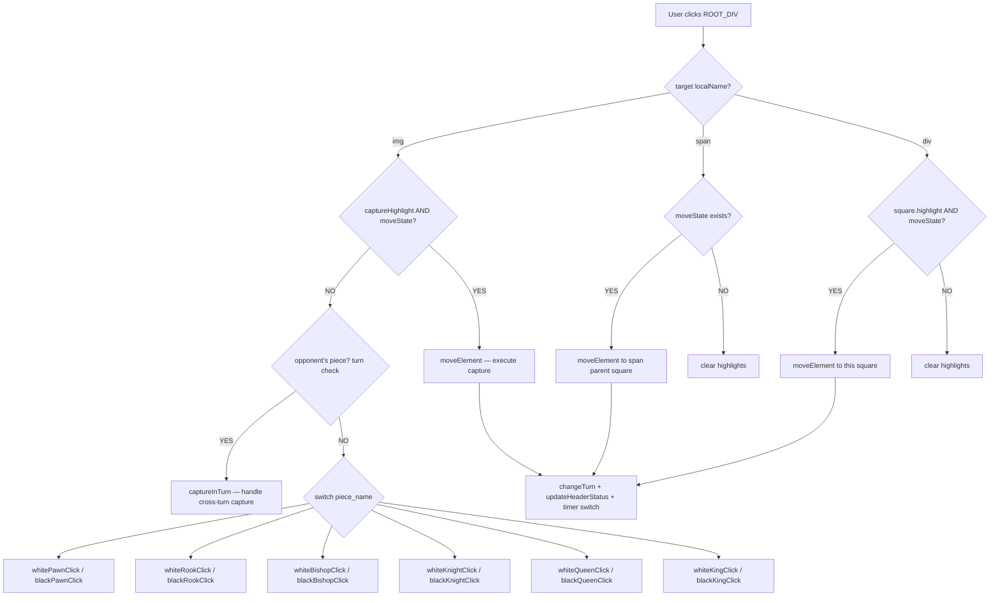
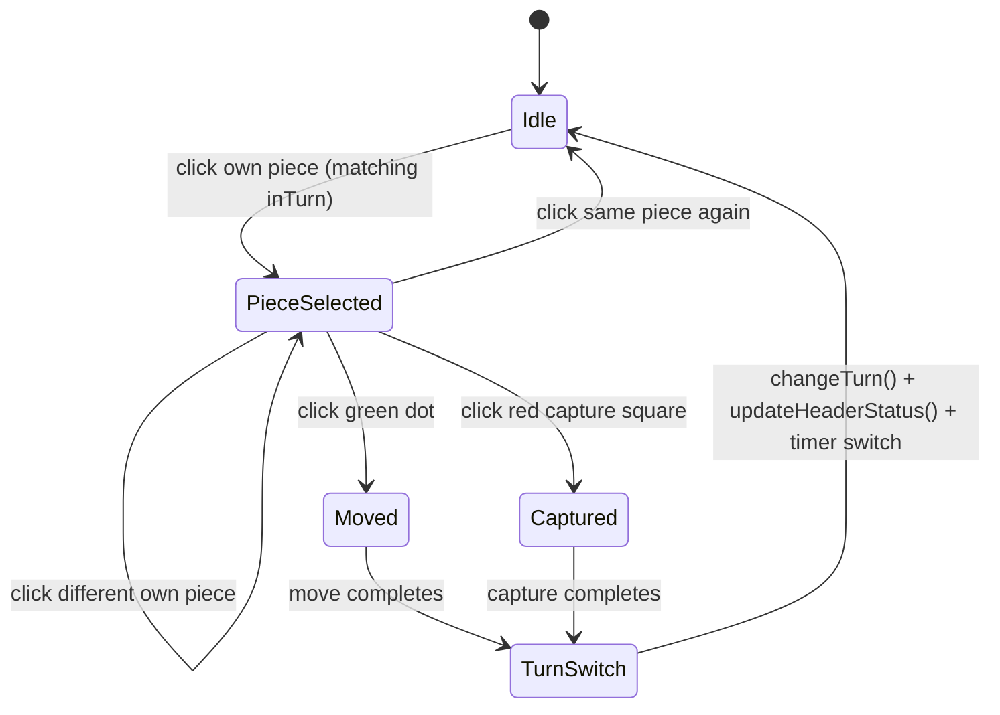
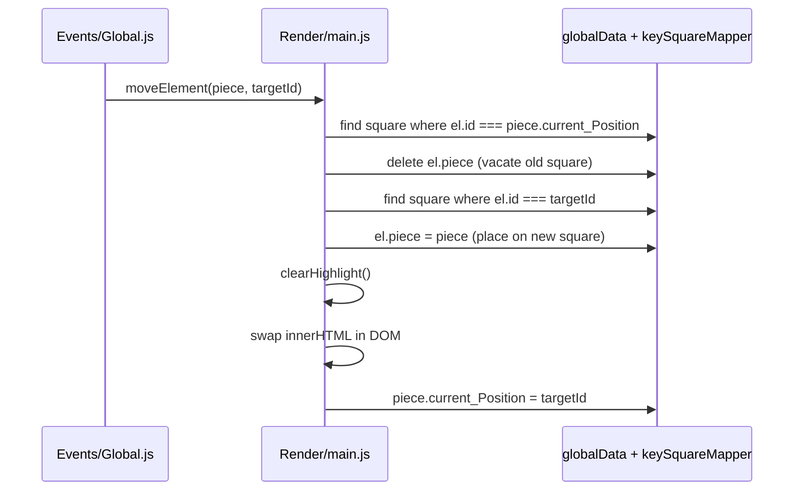
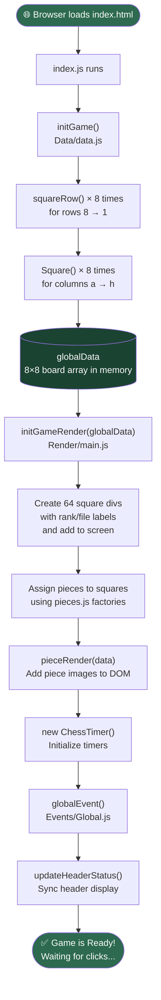
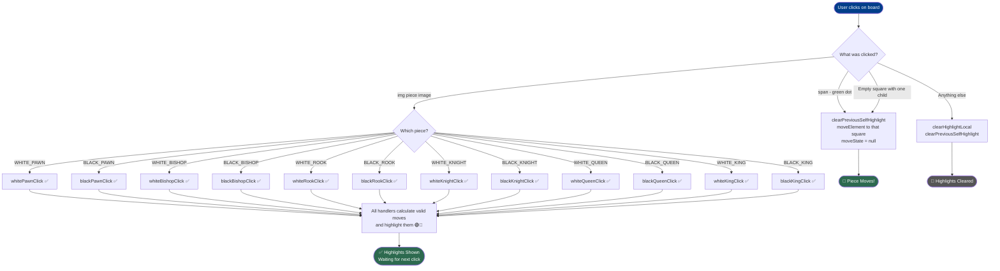
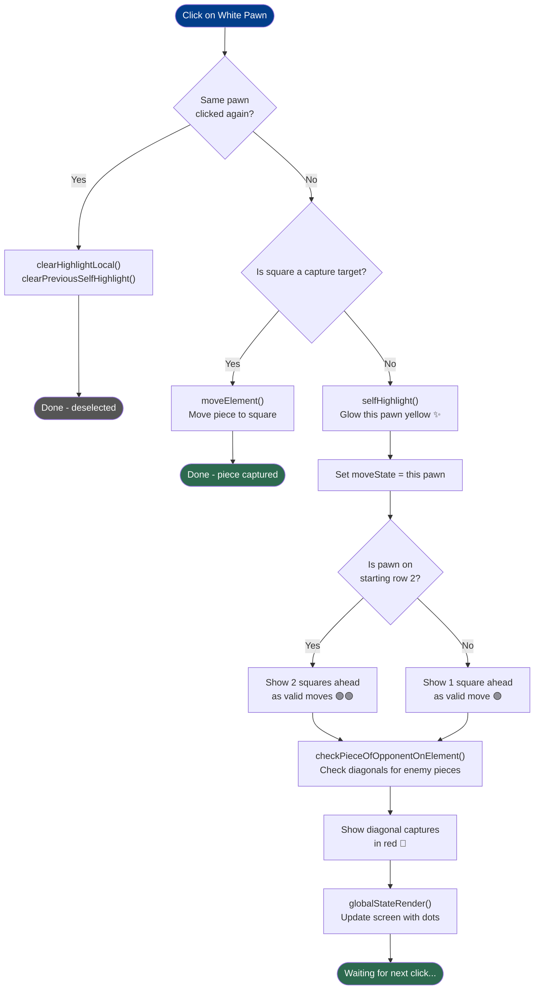
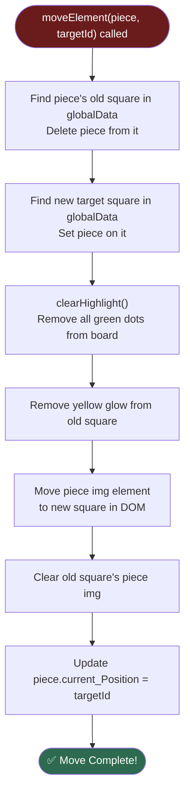
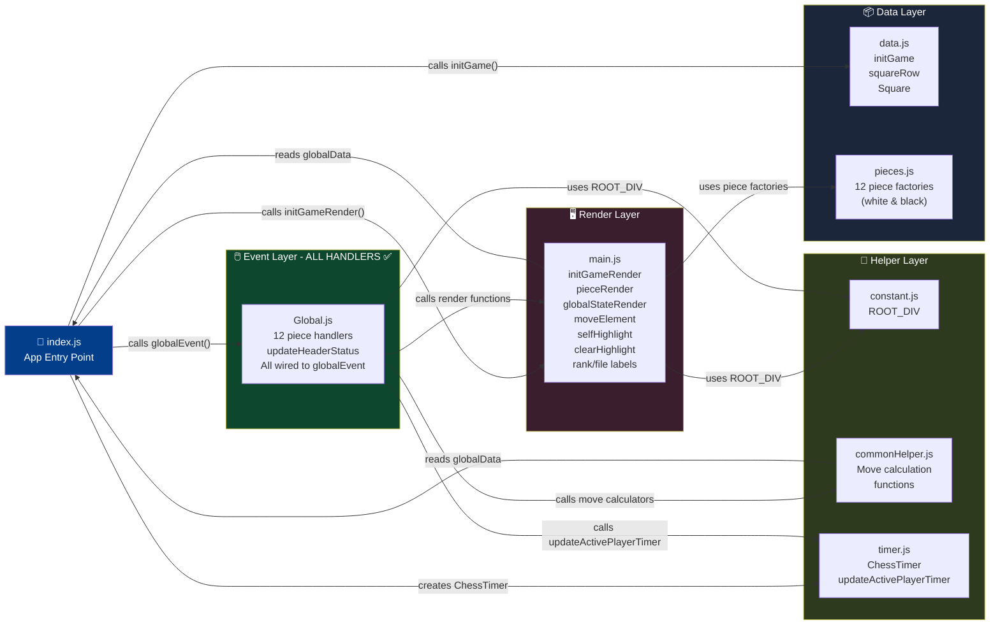

# 🏗️ ChessCode — Architecture & Design

**Last Updated:** August 29, 2026

This document covers the system architecture, module layers, data structures, and visual flowcharts for the entire ChessCode project.

---

## 📐 Module Layer Map

```
┌──────────────────────────────────────────────────────┐
│                   Browser / DOM                      │
└───────────────────────┬──────────────────────────────┘
                        │  click events
                        ▼
┌──────────────────────────────────────────────────────┐
│              Events Layer  (Events/Global.js)        │
│  • globalEvent()   — single delegated click listener │
│  • 12 piece click handlers (turn-gated)              │
│  • changeTurn()    — toggle turn, update UI, timer   │
│  • updateHeaderStatus() — sync header status bar     │
│  • moveElement()   — execute moves with logging      │
│  • checkForPawnPromotion() / callBackPawnPromotion()  │
│  • checkForCheck() — stub for check detection        │
│  • captureInTurn() — capture validation              │
└──────┬──────────────────────────────────────┬────────┘
       │ calls                                │ calls
       ▼                                      ▼
┌──────────────────┐                ┌──────────────────────┐
│   Helper Layer   │                │   Render Layer        │
│ commonHelper.js  │                │   Render/main.js      │
│ • checkPiece     │                │ • initGameRender()    │
│   OfOpponent     │                │ • pieceRender()       │
│ • checkSquare    │                │ • globalStateRender() │
│   CaptureId      │                │ • selfHighlight()     │
│ • giveXXX        │                │ • clearHighlight()    │
│   Ids()          │                │ • renderHighlight()   │
│ • giveXXX        │                │ • rank/file labels    │
│   CaptureIds()   │                │                       │
│                  │                └────────────┬─────────┘
│ logging.js       │                             │
│ • logMoves()     │                             │
│                  │                             │
│ timer.js         │                             │
│ • ChessTimer     │                             │
│ • switchTurn()   │                             │
│ • updateActive   │                             │
│   PlayerTimer()  │                             │
│                  │                             │
│ modelCreator.js  │                             │
│ • ModalCreater   │                             │
│ • pawnPromotion()│                             │
└──────┬───────────┘                             │
       │                                         │
       │ reads                                   │ reads/writes
       ▼                                         ▼
┌──────────────────────────────────────────────────────┐
│                   Data Layer                         │
│                                                      │
│  index.js — globalData (8×8 array) + keySquareMapper │
│            + globalPiece (named piece refs)           │
│            + chessTimer (timer instance)              │
│            + window.__chess (testing API)             │
│  Data/data.js — Square(), squareRow(), initGame()    │
│  Data/pieces.js — 12 piece factory functions         │
│  Helper/constant.js — ROOT_DIV                       │
└──────────────────────────────────────────────────────┘
```

---

## 🔗 Import / Export Graph



---

## 🚀 Boot Sequence (Startup)



---

## 🖱️ Click Event Flow



---

## 🔄 State Machine (Game State Variables)



**Variables:**

| Variable | Type | Meaning |
|---|---|---|
| `highlightState` | `boolean` | `true` when a piece is selected and move dots are visible |
| `selfHighlightState` | `piece or null` | Piece object currently glowing yellow |
| `moveState` | `piece or null` | Piece ready to be moved on next valid click |
| `inTurn` | `string` | Current turn — `"white"` or `"black"` |

---

## 📁 File Responsibility Summary

| File | Layer | Responsibility |
|---|---|---|
| `index.html` | Entry | App header (logo, status), board container, side panel (timers, move logger), footer |
| `index.js` | Bootstrap | Runs 3-step init; exports `globalData`, `keySquareMapper`, `globalPiece`, `chessTimer`; exposes `window.__chess` for testing |
| `Data/data.js` | Data | `Square()`, `squareRow()`, `initGame()` — builds board array |
| `Data/pieces.js` | Data | 12 piece factory functions with `move` flag for castling-tracked pieces |
| `Helper/constant.js` | Shared | Exports `ROOT_DIV` |
| `Helper/commonHelper.js` | Logic | Move range calculators, capture detection, check-detection helpers |
| `Helper/logging.js` | UI | Move logger with Unicode chess symbols and chess notation |
| `Helper/timer.js` | Logic/UI | `ChessTimer` class — countdown, timeout, low-time warnings; `updateActivePlayerTimer()` — toggles timer card active state |
| `Helper/modelCreator.js` | UI | Pawn promotion modal with piece selection |
| `Render/main.js` | Render | All DOM operations: draw, highlight, move, clear, rank/file labels |
| `Events/Global.js` | Events | All click handlers, turn management, move execution, `updateHeaderStatus()`, timer integration; exposes `window.getInTurn()`/`window.setInTurn()` |
| `style/style.css` | Style | Header, board, timers, logger, modals, footer, timeout overlay |
| `style/mobile.css` | Style | Mobile responsive breakpoints (tablet, phone, landscape) |

---

# 🗃️ Data Structures

---

## 🗺️ Big Picture: Two Data Stores

```
globalData          →  source of truth for board state
keySquareMapper     →  O(1) lookup dictionary (id → square)
```

Both are created in `index.js` and exported to every module that needs them.

---

## 📦 `globalData` — The Board Array

### Shape
An **8×8 nested array** where each row is an array of 8 Square objects.

```js
globalData[rowIndex][colIndex] = Square

globalData[0]    // Row 8 — Black pieces start here
globalData[7]    // Row 1 — White pieces start here
globalData[0][0] // Square a8
globalData[7][4] // Square e1 (white king)
```

### Row Mapping

| `globalData[i]` | Chess Row | Contents |
|---|---|---|
| `[0]` | Row 8 | Black rook, knight, bishop, queen, king, bishop, knight, rook |
| `[1]` | Row 7 | Black pawns |
| `[2]` | Row 6 | Empty |
| `[3]` | Row 5 | Empty |
| `[4]` | Row 4 | Empty |
| `[5]` | Row 3 | Empty |
| `[6]` | Row 2 | White pawns |
| `[7]` | Row 1 | White rook, knight, bishop, queen, king, bishop, knight, rook |

---

## 🔲 Square Object Schema

Created by `Square(color, piece, id)` in `Data/data.js`.

```js
{
  id:               "e2",        // String — chess coordinate (column a–h + row 1–8)
  color:            "white",     // String — "white" or "black" (square tile color)
  piece:            null,        // Piece object or null (no piece on this square)

  // Runtime state — added dynamically during gameplay
  highlight:        true,        // Boolean/null — true = show green move dot
  captureHighlight: true,        // Boolean — true = square is a capture target (red)
}
```

### ID Format

```
id = column + row
   = [a–h]  + [1–8]

Examples:
  "a1" → bottom-left (white queen-side rook)
  "h8" → top-right   (black king-side rook)
  "e4" → center square (e file, row 4)
```

---

## ♟️ Piece Object Schema

Created by factory functions in `Data/pieces.js`.

```js
{
  current_Position: "e2",            // String — current square ID (updated on move)
  img:              "./Assets/pieces/white/pawn.png",  // Asset path (lowercase 'pieces')
  piece_name:       "WHITE_PAWN",    // Identifier — format: COLOR_TYPE
}
```

### `piece_name` Values

| piece_name | Color | Type |
|---|---|---|
| `WHITE_PAWN` | White | Pawn |
| `WHITE_ROOK` | White | Rook |
| `WHITE_KNIGHT` | White | Knight |
| `WHITE_BISHOP` | White | Bishop |
| `WHITE_QUEEN` | White | Queen |
| `WHITE_KING` | White | King |
| `BLACK_PAWN` | Black | Pawn |
| `BLACK_ROOK` | Black | Rook |
| `BLACK_KNIGHT` | Black | Knight |
| `BLACK_BISHOP` | Black | Bishop |
| `BLACK_QUEEN` | Black | Queen |
| `BLACK_KING` | Black | King |

### Color Detection Pattern

```js
// Check if piece is white
piece.piece_name.startsWith("WHITE_")

// Check if piece is black
piece.piece_name.startsWith("BLACK_")

// Check if piece contains opponent color
piece.piece_name.includes("BLACK") // used by checkPieceOfOpponentOnElement("white")
```

---

## ⚡ `keySquareMapper` — O(1) Square Lookup

### Purpose
A flat dictionary built from `globalData` that maps every square ID directly to its Square object. Avoids slow O(64) `Array.flat().forEach()` scans on every click.

### Shape
```js
keySquareMapper = {
  "a1": { id: "a1", color: "black", piece: {...} },
  "a2": { id: "a2", color: "white", piece: {...} },
  // ... all 64 squares
  "h8": { id: "h8", color: "black", piece: {...} },
}
```

### How It's Built
```js
// In index.js — O(N) one-time setup
let keySquareMapper = {};
globalData.flat().forEach((square) => {
  keySquareMapper[square.id] = square;
});
```

### Usage Pattern
```js
// Anywhere in the codebase — O(1) lookup
const square = keySquareMapper["e4"];
square.highlight = true;
```

---

## 🔁 Data Flow on Piece Move



---

## 🗂️ Asset Path Convention

```
Assets/
  pieces/
    white/
      pawn.png
      rook.png
      knight.png
      bishop.png
      queen.png
      king.png
    black/
      pawn.png
      rook.png
      knight.png
      bishop.png
      queen.png
      king.png
```

Path format in piece objects: `"./Assets/pieces/{color}/{type}.png"`

> ⚠️ Note: The folder is lowercase `pieces/`, not `Pieces/`.

---

# 📊 Flowcharts

---

## 🟢 App Startup Flow



---

## 🖱️ Click Handler Flow



---

## ⬜ White Pawn Click Flow



---

## 🏃 Piece Move Flow



---

## 🗺️ Complete Big Picture



---

## Pawn Click Summary Table

| Step | White Pawn | Black Pawn |
|------|-----------|-----------| 
| 1 | Check if same pawn clicked | Check if same pawn clicked |
| 2 | Check if square is capture target | Check if square is capture target |
| 3 | Deselect (if same) or Move (if capture) | Deselect (if same) or Move (if capture) |
| 4 | Select pawn & set states | Select pawn & set states |
| 5 | Determine moves (+1/+2) | Determine moves (-1/-2) |
| 6 | Check diagonals for captures | Check diagonals for captures |
| 7 | Render to screen | Render to screen |

---

## Flow Summary

| Flow | Triggered By | Key Functions Called |
|------|-------------|---------------------|
| **App Start** | Browser loads page | `initGame` → `initGameRender` → `new ChessTimer()` → `globalEvent` → `updateHeaderStatus` |
| **Click ANY piece img** | User clicks pawn, rook, bishop, knight, queen, or king | Dispatches to appropriate handler (whitePawnClick, whiteRookClick, etc.) |
| **Click green dot** | User clicks valid move square | `moveElement` → `clearHighlight` → `globalStateRender` |
| **Any piece selected** | Any click handler runs | `clearPreviousSelfHighlight` → `selfHighlight` → `globalStateRender` |
| **Piece moves** | `moveElement` runs | `clearHighlight` → DOM swap → update `current_Position` |
