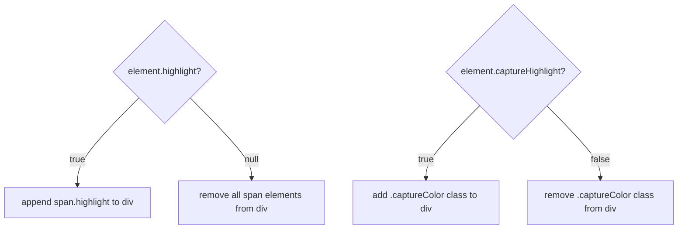

# 🎨 ChessCode — UI/UX Design

**Last Updated:** September 2, 2026

Covers: Visual design system, color palette, CSS class system, board layout, timer/logger UI, and the highlighting state model.

---

## 🎨 Color Palette

| Token | Hex | Usage |
|---|---|---|
| Page background | `#302E2B` | Dark charcoal — mimics chess.com dark theme |
| Light square | `#ebecd0` | Cream — classic light tile |
| Dark square | `#779556` | Olive green — classic dark tile |
| Selected piece | `#f7f769` | Bright yellow — self-highlight glow |
| Capture target | `#EE4b2b` | Vivid red-orange — enemy capture square |
| Move dot fill | `rgba(0,0,0,0.2)` | Translucent black — valid move indicator |
| Last move highlight | `rgba(255,255,50,0.38)` | Translucent yellow — source/destination of last move |
| Timer active glow | `rgba(100,255,170,0.3)` | Green glow — active player's timer |
| Timer low-time | `#ff4444` | Red — below 30 seconds warning |
| Global text | `white` | Applied via `* { color: white }` |
| Side panel background | `#262522` | Dark panels — logger, turn indicator |
| Side panel border | `#3d3b37` | Subtle border — separates panels |

---

## 📐 Board Layout

### Desktop Dimensions

```
Board total:  600px × 600px
Square size:   75px ×  75px  (8 × 75 = 600)
Piece image:   75px ×  75px  (fills square completely)
Move dot:      25px ×  25px  (centered via absolute position)
Label font:    12px          (16% of square size)
```

### Mobile Dimensions (Responsive)

All sizes scale proportionally using `calc()` with viewport units:

| Breakpoint | Board Width | Square Size | Dot Size | Label Size |
|---|---|---|---|---|
| Desktop (>1024px) | 600px | 75px | 25px | 12px |
| Tablet (≤1024px) | `min(90vw, 560px)` | `boardWidth / 8` | `square / 3` | `square × 0.16` |
| Phone (≤600px) | `96vw` | `boardWidth / 8` | `square / 3` | `square × 0.16` |
| Small phone (≤400px) | `98vw` | `boardWidth / 8` | `square / 3` | `square × 0.16` |
| Landscape phone | `85vh` (height-based) | `boardHeight / 8` | `square / 3` | `square × 0.16` |

### Page Layout (Flexbox)

**Desktop:**
```
┌──────────────────────────────────────────────────────────────┐
│  .app-header (sticky, #game-status turn indicator)           │
├──────────────────────────────────────────────────────────────┤
│  #flex (display: flex, gap: 24px)                            │
│                                                              │
│  ┌────────────────────┐  ┌─────────────────────────────────┐ │
│  │  .board-container  │  │  .side-panel                    │ │
│  │                    │  │                                 │ │
│  │  ┌──────────────┐  │  │  ┌───────────────────────────┐ │ │
│  │  │    #root     │  │  │  │ .timers-widget            │ │ │
│  │  │  (8×8 board) │  │  │  │ ┌───────────┬───────────┐ │ │ │
│  │  │              │  │  │  │ │● Black    │○ White    │ │ │ │
│  │  │              │  │  │  │ │  10:00    │  10:00    │ │ │ │
│  │  │              │  │  │  │ └───────────┴───────────┘ │ │ │
│  │  │              │  │  │  └───────────────────────────┘ │ │
│  │  │              │  │  │  ┌───────────────────────────┐ │ │
│  │  │              │  │  │  │ #chessboardmovelogger     │ │ │
│  │  │              │  │  │  │  ┌─ Moves ────────────┐   │ │ │
│  │  │              │  │  │  │  │ 1. e2→e4   e7→e5   │   │ │ │
│  │  │              │  │  │  │  │ 2. ...             │   │ │ │
│  │  │              │  │  │  │  └────────────────────┘   │ │ │
│  │  └──────────────┘  │  │  └───────────────────────────┘ │ │
│  └────────────────────┘  └─────────────────────────────────┘ │
├──────────────────────────────────────────────────────────────┤
│  .app-footer                                                 │
└──────────────────────────────────────────────────────────────┘
```

**Mobile (≤600px):** Board and logger stack vertically (flex-direction: column).

**Landscape phone:** Side-by-side using `vh` units for height-constrained fitting.

---

## 🏷️ CSS Class System

### Base Classes

| Class | Applied To | Effect |
|---|---|---|
| `.square` | Every `div` square | `75×75px`, `position: relative` |
| `.white` | Light tile squares | `background: #ebecd0` |
| `.black` | Dark tile squares | `background: #779556` |
| `.squareRow` | Each row wrapper | `flex, 600×75px` |
| `.piece` | Piece `` tags | `75×75px`, `cursor: pointer` |

### State Classes (added/removed at runtime)

| Class | Applied To | Trigger | Effect |
|---|---|---|---|
| `.highlightYellow` | Square `div` | Piece selected | Yellow background `#f7f769` |
| `.captureColor` | Square `div` | Enemy piece in range | Red-orange background `#EE4b2b` |
| `.lastMoveHighlight` | Square `div` | After move completes | Translucent yellow on source + destination |

### Status Indicator Classes

| Class | Applied To | Trigger | Effect |
|---|---|---|---|
| `.status-indicator` | `#game-status` div | Always | Base pill styling in header |
| `.status-indicator.white-turn` | `#game-status` div | White's turn | Cream border + glow + cream status dot |
| `.status-indicator.black-turn` | `#game-status` div | Black's turn | Green border + glow + green status dot |

### Timer Classes

| Class | Applied To | Trigger | Effect |
|---|---|---|---|
| `.timer-card` | Timer card `div` | Always | Base timer card styling |
| `.timer-card.active-player` | Timer card `div` | Current player's turn | Elevated, color-matched border + glow |
| `.timer` | Timer `div` | Always | Base timer text styling (JetBrains Mono) |
| `.timer.active` | Timer `div` | Current player counting | Bright white text with glow |
| `.timer.low-time` | Timer `div` | < 30 seconds remaining | Red text, pulsing glow animation |

### DOM Children (highlight dot)

| Element | Class | Trigger | Effect |
|---|---|---|---|
| `<span>` | `.highlight` | `element.highlight = true` | Dark circle centered in square (1/3 of square size) |

---

## 🔦 Highlight State Model

Each square in `globalData` has two flags that drive visual feedback:

```
square.highlight        → null / true
square.captureHighlight → false / true
```

### Rendering Rules



### Priority Rule

> **Capture beats move-dot:** When a square is marked as a capture target (`captureHighlight = true`), its `highlight` flag is immediately cleared to `null`. This prevents the green dot from rendering underneath the red background.

---

## 📊 Visual State Table

| Square State | `.highlightYellow` | `.captureColor` | `.lastMoveHighlight` | `span.highlight` | Appearance |
|---|---|---|---|---|---|
| Default (empty) | ❌ | ❌ | ❌ | ❌ | Normal tile color |
| Selected piece | ✅ | ❌ | ❌ | ❌ | Yellow glow |
| Valid move dot | ❌ | ❌ | ❌ | ✅ | Dark circle in center |
| Capture target | ❌ | ✅ | ❌ | ❌ | Red-orange tile |
| Last move square | ❌ | ❌ | ✅ | ❌ | Translucent yellow overlay |

---

## ⏱️ Timer UI

```
┌─────────────────────────────────┐
│  .timers-widget (in side panel)    │
│  ┌─────────────┐┌─────────────┐  │
│  │● Black 10:00││○ White 10:00│  │
│  └─────────────┘└─────────────┘  │
└─────────────────────────────────┘
```

- **Active timer card** has color-matched border (cream for white, green for black), elevated shadow, bright text
- **Low-time** (<30s) pulses red with `animation: pulse-red 1s infinite alternate`
- **Timeout** shows full-screen overlay with winner announced and "Restart Game" button

---

## 🔮 Design Tokens Cheatsheet

```css
/* Fonts */
--font-ui:       "Inter", sans-serif;
--font-mono:     "JetBrains Mono", monospace;

/* Colors */
--bg-page:       #302E2B;
--sq-light:      #ebecd0;
--sq-dark:       #779556;
--hl-selected:   #f7f769;
--hl-capture:    #EE4b2b;
--hl-dot:        rgba(0, 0, 0, 0.2);
--hl-lastmove:   rgba(255, 255, 50, 0.38);
--panel-bg:      #262522;
--panel-border:  #3d3b37;
--timer-active:  rgba(100, 255, 170, 0.3);
--timer-low:     #ff4444;

/* Sizes (Desktop) */
--board-size:    600px;
--square-size:   75px;
--dot-size:      25px;
```

---

## 📱 Mobile Responsive Stylesheet

The responsive layout lives in `style/mobile.css` (separate from the desktop styles) with 4 breakpoints:

| Breakpoint | Target | Layout | Board Sizing |
|---|---|---|---|
| ≤1024px | Tablets | Vertical stack | `min(90vw, 560px)` |
| ≤600px | Phones | Vertical stack | `96vw` |
| ≤400px | Small phones | Vertical stack | `98vw` |
| Landscape + ≤500px height | Rotated phones | Side-by-side | `85vh` |

All elements (squares, pieces, highlights, labels) scale proportionally using `calc()` — no fixed pixel values on mobile.
